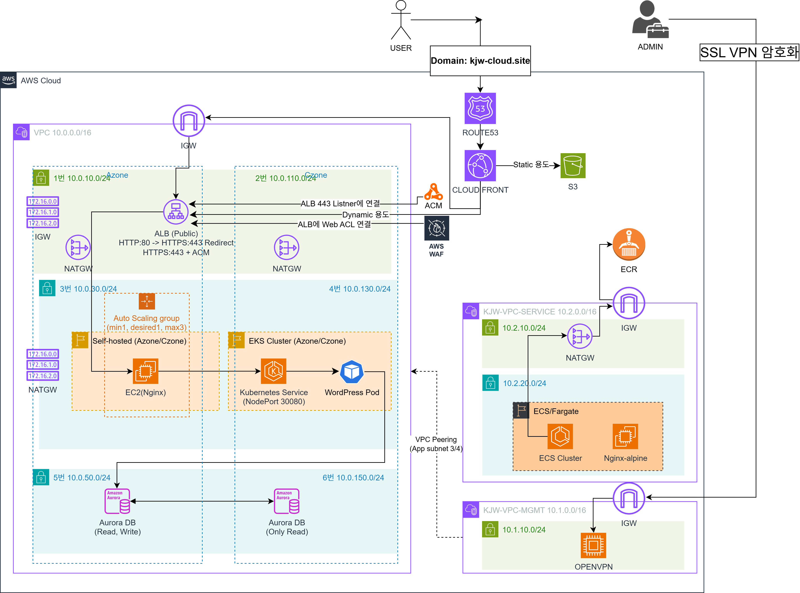

# AWS Multi-VPC 3-Tier Infrastructure (Terraform)

<div align="center">
  
  
  
  
  
  
  
  
  
  
  <br/>
</div>

> **Terraform으로 설계·구축한 멀티 VPC 기반 3-Tier AWS 인프라 프로젝트입니다. <br/> 정적 요청은 CloudFront + S3로 분리하고, <br/>동적 요청은 WAF + ALB + EC2 Nginx + EKS + Aurora 경로로 처리하며,<br/> 관리자 접근은 별도 MGMT VPC의 OpenVPN 경로로 분리했습니다.**

---

## Overview

| 항목 | 내용 |
|---|---|
| 목표 | production-like AWS 웹 인프라를 Terraform으로 모듈화 |
| 핵심 토폴로지 | MAIN / MGMT / SERVICE 3개 VPC + VPC Peering |
| 동적 경로 | CloudFront → WAF → ALB → EC2 Nginx → EKS → Aurora |
| 정적 경로 | CloudFront → S3 (OAC) |
| 인프라 범위 | VPC, SG, ALB, ACM, Route53, CloudFront, WAF, EKS, ECS, Aurora, ECR, S3, OpenVPN |
| 상태 관리 | Local backend (학습용) |

---

## Architecture



---

## What I Built

- MAIN VPC에는 public/app/db 계층을 분리하고, MGMT VPC와 SERVICE VPC를 별도로 구성했습니다.
- CloudFront에서 `/images/*`, `/css/*`, `/js/*`는 S3로, 기본 경로는 WAF와 ALB를 거쳐 동적 애플리케이션 경로로 분기했습니다.
- EKS를 ALB에 직접 연결하지 않고, EC2 Nginx reverse proxy를 중간 계층으로 두어 WordPress 요청을 전달했습니다.
- Aurora MySQL writer/reader 구성을 private DB subnet에 배치했습니다.
- OpenVPN을 통해 관리자 전용 접근 경로를 분리했고, ECS Fargate 워크로드는 SERVICE VPC에 독립 배치했습니다.

---

## Traffic Flow

### User Traffic

```text
Browser
  -> Route53
  -> CloudFront
     -> S3 for static paths
     -> WAF -> ALB -> EC2 Nginx -> EKS NodePort -> WordPress -> Aurora
```

### Admin Traffic

```text
Admin
  -> OpenVPN
  -> MGMT VPC
  -> VPC Peering
  -> SSH to EC2 Nginx / MySQL to Aurora
```

### ECS Workload

```text
ECS Fargate
  -> NAT Gateway
  -> Internet Gateway
  -> Amazon ECR
```

---

## Skills Demonstrated

- Terraform root/module composition and variable-driven configuration
- AWS 네트워크 분리와 라우팅 설계
- public, app, db 계층 간 security group chaining
- CDN, TLS, WAF, private S3 origin 설계
- EKS, ECS, Aurora, EC2를 하나의 환경에 통합하는 설계
- 배포 이후 운영 절차를 문서화하는 방식의 인프라 정리

---

## Key Design Decisions

| 결정 | 이유 |
|---|---|
| ALB → EC2 Nginx → EKS NodePort | AWS Load Balancer Controller 없이 EKS를 직접 타겟으로 연결하지 않고, reverse proxy 계층으로 제어하기 위해 |
| CloudFront 정적/동적 분기 | 정적 리소스는 S3 캐시 효율을 높이고, 동적 요청은 캐시 없이 ALB로 전달하기 위해 |
| MGMT VPC 별도 분리 | 운영자 접근 경로를 서비스 경로와 분리하고, OpenVPN 기반 접근 통제를 단순화하기 위해 |
| ACM 2개 리전 운용 | ALB는 us-east-2, CloudFront는 us-east-1 인증서가 필요하기 때문 |
| `/health` 전용 경로 | EKS 준비 전에도 ALB health check가 안정적으로 통과하도록 하기 위해 |
| CloudFront OAC + S3 Public Access Block | S3를 퍼블릭 오리진으로 열지 않고 CloudFront를 통해서만 접근하게 하기 위해 |

---

## Scope And Limitations

- Terraform은 AWS 인프라 리소스를 중심으로 관리합니다.
- WordPress Deployment/Service는 `kubectl`과 YAML로 별도 배포합니다.
- 첫 배포에는 NS 위임, ACM 발급 대기, ECR push, `eks_service_endpoint` 재적용 같은 수동 단계가 포함됩니다.
- 상태 관리는 local backend 기준이며, remote state 구성까지는 포함하지 않았습니다.
- 포트폴리오/학습 프로젝트 기준으로 구성되어 있으며, 운영 표준화는 추가 개선 여지가 있습니다.

---

## Quick Start

1. [Getting Started](docs/GETTING-STARTED.md)에서 로컬 준비와 첫 `terraform apply` 절차를 확인합니다.
2. 초기 배포가 끝나면 [After Apply](docs/AFTER-APPLY.md) 순서대로 WordPress 배포와 후속 설정을 진행합니다.
3. 문제 발생 시 [Troubleshooting](docs/TROUBLESHOOTING.md)를 참고합니다.

---

## Documentation

| 문서 | 내용 |
|---|---|
| [Getting Started](docs/GETTING-STARTED.md) | 로컬 준비, 필수 변수 입력, 첫 `terraform apply` |
| [Architecture](docs/ARCHITECTURE.md) | 전체 아키텍처 다이어그램 및 상세 설명 |
| [After Apply](docs/AFTER-APPLY.md) | 첫 apply 이후 수동 작업 체크리스트 |
| [Troubleshooting](docs/TROUBLESHOOTING.md) | 구축 중 발생한 이슈와 해결 기록 |
| [Design & Plan](docs/AGENTS.md) | 구현 기준 설계 메모와 모듈 요약 |
